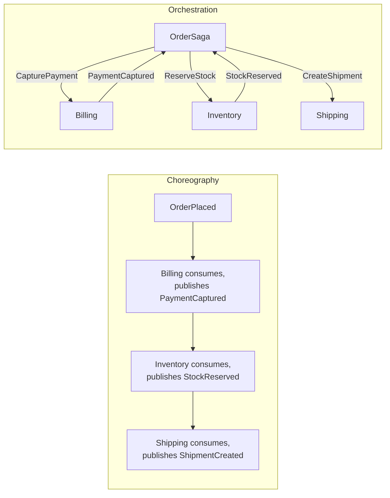

# Event-Driven Architecture

## What It Is

**Event-driven architecture (EDA)** is a style where independent components communicate by **publishing** and **subscribing to events** instead of calling each other directly. A component states a fact ("an order was placed"); zero or more other components react. The producer doesn't know — and doesn't care — who consumes the event.

The transport is a **message broker**. In .NET / Azure, the three common ones are:

- **[Azure Service Bus](../azure/azure-service-bus.md)** — broker-style messaging with queues (point-to-point) and topics/subscriptions (publish/subscribe). Ordering, sessions, dead-letter queues, transactional sends.
- **Azure Event Grid** — push-based pub/sub for reactive scenarios with massive fan-out (storage events, IoT, Azure resource events).
- **Azure Event Hubs** — high-throughput streaming for telemetry / events at millions/sec. Partition-based, replayable, consumer-group model.

```text
  ┌──────────────┐     ┌─────────────────────────┐     ┌────────────────────┐
  │ Order API    │────▶│ Service Bus Topic       │────▶│ Billing Service    │
  │ (publisher)  │     │   orders/order-placed   │────▶│ Inventory Service  │
  └──────────────┘     │                         │────▶│ Notifications Svc  │
                       └─────────────────────────┘     │ Analytics Pipeline │
                                                       └────────────────────┘
```

Two coordination styles within EDA:

- **Choreography** — each service reacts independently to events; no central coordinator. Simpler but emergent flows are hard to visualize.
- **Orchestration** — a coordinator ("saga") explicitly sends commands and reacts to events. See [saga pattern](saga-pattern.md).

EDA is not the same as [microservices](microservices-architecture.md) — you can have microservices that talk synchronously over HTTP, and you can have a modular monolith that uses in-process events. EDA is specifically about **asynchronous, decoupled communication**.

## Why It Exists

Synchronous request/response works fine when one service needs an answer *now* from another (auth check, fraud score). It breaks down when:

- A business event has many interested parties — placing an order should trigger billing, inventory, shipping, notifications, loyalty, analytics, and fraud detection. Calling all of them inline makes the order API slow and tightly coupled.
- The downstream service is sometimes down — synchronous calls cascade failures upward (one slow service → all callers slow → timeouts everywhere).
- Different consumers need different SLAs — notifications can be eventual, payment capture must succeed before order acknowledgment.
- New consumers appear over time — adding a "fraud check" must not require redeploying the order service.

EDA was popularized in the 2000s with enterprise service buses; the modern cloud variant (Service Bus, Kafka, EventBridge) made it scalable, durable, and operationally cheap. It exists to:

1. Decouple producers from consumers in **time** (consumer doesn't have to be up when the event is produced), **space** (no direct address), and **scale** (consumers scale independently).
2. Turn cascading failures into queues that absorb shock and retry.
3. Enable additive evolution — new consumers subscribe without changing producers.

## When To Use It

**Use EDA for:**

- **Fan-out workflows** — one fact triggers many independent reactions (`OrderPlaced` → billing, inventory, email, analytics).
- **Buffering load** — high-volume bursts that downstream systems can't handle synchronously (file uploads → virus scan → thumbnail → indexing).
- **Cross-service workflows** — multi-step business processes spanning services, especially when paired with [sagas](saga-pattern.md) and the [outbox pattern](outbox-pattern.md).
- **Stream processing** — telemetry, IoT, clickstreams via Event Hubs.
- **Loose coupling between teams** — different teams own producers and consumers; the event schema is the contract.
- **Integration with external systems** — webhooks, third-party SaaS, file drop processing.

**Do not use EDA for:**

- **Request/response where the caller needs an immediate answer** — authentication, authorization, fraud scoring, inventory check during checkout. Use REST/gRPC for these.
- **Simple CRUD operations within one service** — in-process method calls are cheaper, simpler, and synchronous.
- **Strict end-to-end transactions** — EDA gives eventual consistency, not ACID across services.
- **Anywhere ordered, exactly-once processing is required without careful design** — most brokers are at-least-once; consumers must be idempotent.
- **A small team with one service** — the operational and cognitive cost of brokers and DLQs outweighs the gain.

## Why It Is Important

EDA changes three properties that matter at scale:

1. **Loose coupling.** The order service publishes `OrderPlaced` and moves on. It doesn't know about the 7 downstream consumers. Adding an 8th is a new subscription, not a code change in the producer.
2. **Resilience.** If a consumer is down, messages queue up. When it comes back, it drains the backlog. Synchronous APIs would have returned errors to users; EDA absorbs the outage transparently.
3. **Scalability.** The producer publishes at the rate of business activity. Each consumer scales independently to match its own workload. A slow consumer doesn't slow the producer or other consumers.

In a microservices system on Azure, EDA is what lets the order service stay 99.95% available even when fulfillment is down for maintenance — orders still flow, fulfillment catches up later. Without EDA, every service's availability multiplies down to one shared number.

## How It's Used in C# / .NET

### 1. Azure Service Bus — topics and subscriptions

```csharp
// Program.cs — register Service Bus
builder.Services.AddSingleton(sp =>
    new ServiceBusClient(
        builder.Configuration["ServiceBus:Namespace"]!,
        new DefaultAzureCredential()));

builder.Services.AddSingleton<IOrderEventPublisher, ServiceBusOrderEventPublisher>();
```

Producer:

```csharp
public sealed class ServiceBusOrderEventPublisher : IOrderEventPublisher
{
    private readonly ServiceBusSender _sender;

    public ServiceBusOrderEventPublisher(ServiceBusClient client) =>
        _sender = client.CreateSender("order-events"); // a topic

    public async Task PublishAsync<T>(T evt, CancellationToken ct) where T : IIntegrationEvent
    {
        var msg = new ServiceBusMessage(BinaryData.FromObjectAsJson(evt))
        {
            MessageId = evt.EventId.ToString(),       // for dedup
            Subject = typeof(T).Name,                  // event type
            ContentType = "application/json",
            ApplicationProperties = { ["SchemaVersion"] = 1 }
        };
        await _sender.SendMessageAsync(msg, ct);
    }
}
```

Consumer (`BackgroundService`):

```csharp
public sealed class BillingEventsConsumer : BackgroundService
{
    private readonly ServiceBusProcessor _processor;
    private readonly IServiceScopeFactory _scopes;
    private readonly ILogger<BillingEventsConsumer> _logger;

    public BillingEventsConsumer(
        ServiceBusClient client, IServiceScopeFactory scopes,
        ILogger<BillingEventsConsumer> logger)
    {
        _processor = client.CreateProcessor(
            "order-events", "billing",                 // topic + subscription
            new ServiceBusProcessorOptions { MaxConcurrentCalls = 4, AutoCompleteMessages = false });
        _scopes = scopes;
        _logger = logger;
    }

    protected override async Task ExecuteAsync(CancellationToken ct)
    {
        _processor.ProcessMessageAsync += OnMessage;
        _processor.ProcessErrorAsync += args => { _logger.LogError(args.Exception, "Processor error"); return Task.CompletedTask; };
        await _processor.StartProcessingAsync(ct);
    }

    private async Task OnMessage(ProcessMessageEventArgs args)
    {
        using var scope = _scopes.CreateScope();
        var handler = scope.ServiceProvider.GetRequiredService<IIntegrationEventHandler>();

        try
        {
            var evt = JsonSerializer.Deserialize<OrderPlacedIntegrationEvent>(args.Message.Body);
            await handler.HandleAsync(evt!, args.CancellationToken);
            await args.CompleteMessageAsync(args.Message, args.CancellationToken);
        }
        catch (Exception ex)
        {
            _logger.LogError(ex, "Failed to process message {MessageId}", args.Message.MessageId);
            // do not complete — broker redelivers; after max delivery count it goes to DLQ
            await args.AbandonMessageAsync(args.Message);
        }
    }
}
```

### 2. MassTransit — higher-level abstraction over Service Bus / RabbitMQ

[MassTransit](https://masstransit.io) handles serialization, retries, dead-lettering, outbox, sagas, and consumer scoping. Recommended for non-trivial systems.

```csharp
builder.Services.AddMassTransit(x =>
{
    x.AddConsumer<OrderPlacedHandler>();

    x.UsingAzureServiceBus((context, cfg) =>
    {
        cfg.Host(builder.Configuration["ServiceBus:Namespace"], h =>
            h.TokenCredential = new DefaultAzureCredential());

        cfg.ReceiveEndpoint("billing-order-placed", e =>
        {
            e.ConfigureConsumer<OrderPlacedHandler>(context);
            e.UseMessageRetry(r => r.Exponential(5, TimeSpan.FromSeconds(1),
                TimeSpan.FromMinutes(1), TimeSpan.FromSeconds(2)));
        });
    });
});

public class OrderPlacedHandler : IConsumer<OrderPlacedIntegrationEvent>
{
    public Task Consume(ConsumeContext<OrderPlacedIntegrationEvent> ctx) =>
        /* capture payment, write invoice */ Task.CompletedTask;
}
```

### 3. Azure Event Grid — push-based fan-out

```csharp
// Event Grid pushes events to your webhook
[HttpPost("/events/blob-uploaded")]
public IActionResult Handle([FromBody] EventGridEvent[] events)
{
    foreach (var e in events)
    {
        if (e.TryGetSystemEventData(out object data) && data is StorageBlobCreatedEventData blob)
            _logger.LogInformation("Blob created: {Url}", blob.Url);
    }
    return Ok();
}
```

### 4. Azure Event Hubs — high-throughput streaming

```csharp
// Producer
await using var producer = new EventHubProducerClient(connectionString, "telemetry");
using var batch = await producer.CreateBatchAsync();
batch.TryAdd(new EventData(BinaryData.FromObjectAsJson(new { sensorId, value, ts })));
await producer.SendAsync(batch);

// Consumer with checkpointing (via EventProcessorClient and Azure Blob storage)
var processor = new EventProcessorClient(blobContainer, "consumer-group", connectionString, "telemetry");
processor.ProcessEventAsync += async args => { /* process */ await args.UpdateCheckpointAsync(); };
await processor.StartProcessingAsync();
```

### 5. Pairing with the outbox pattern

A producer that owns its own DB must use the [outbox pattern](outbox-pattern.md) so the DB write and the broker send are transactional:

```csharp
// Inside the command handler — same DbContext, same transaction
_orders.Add(order);
_outbox.Enqueue(new OrderPlacedIntegrationEvent(order.Id, order.CustomerId));
await _uow.SaveChangesAsync(ct);

// A separate BackgroundService drains the outbox and publishes to Service Bus
```

### 6. Choreography vs orchestration



Choreography is simpler for 2-3 steps. Orchestration scales better when steps grow, compensations exist, and operational visibility matters. See [saga pattern](saga-pattern.md).

### 7. Schema evolution

Integration events are public contracts. To evolve safely:

- **Versioned event types**: `OrderPlacedV1`, `OrderPlacedV2`. Producer publishes both during transition; consumers migrate at their own pace.
- **Additive changes only**: never rename or remove fields without a new version.
- **`SchemaVersion` property** on the message so consumers can route by version.
- **Shared contracts in a NuGet package** so producers and consumers compile against the same definition.

### 8. Quick reference

| Need                              | Azure service           | .NET library                                |
|-----------------------------------|-------------------------|---------------------------------------------|
| Queue (1 consumer per message)    | Service Bus Queue       | `Azure.Messaging.ServiceBus`                |
| Pub/sub (fan-out)                 | Service Bus Topic       | `Azure.Messaging.ServiceBus`                |
| Massive fan-out / system events   | Event Grid              | `Azure.Messaging.EventGrid`                 |
| High-throughput streaming         | Event Hubs              | `Azure.Messaging.EventHubs`                 |
| Higher-level messaging framework  | (any broker)            | MassTransit, NServiceBus                    |
| Transactional publish             | DB + Service Bus        | [Outbox pattern](outbox-pattern.md) + EF Core |
| Long-running workflow             | Service Bus or Durable Functions | MassTransit Saga, Durable Functions |
| Consumer scaling                  | AKS / App Service / Functions | `BackgroundService`, KEDA              |

## Advantages

- **Loose coupling** — producers don't know consumers.
- **Resilience** — broker absorbs consumer outages; messages queue and replay.
- **Independent scaling** — each consumer scales to its own workload.
- **Additive evolution** — new consumers subscribe without changing producers.
- **Audit trail** — broker retains messages; you can replay them.
- **Async fan-out** — a single business event fans out to N services without a coordinator.
- **Smooths load** — bursts get queued instead of overloading downstream services.

## Disadvantages

- **Eventual consistency** — consumers update later, sometimes seconds later. UI must handle the lag.
- **Hard to trace** — a business outcome involves N services and M messages. Distributed tracing (OpenTelemetry, Application Insights) is mandatory.
- **At-least-once delivery** — messages can be redelivered. Consumers must be idempotent.
- **Schema evolution discipline** — broken contracts break downstream silently.
- **Operational complexity** — DLQs, retries, monitoring, broker capacity planning, replay tooling.
- **Debugging is harder** — no stack trace from producer to consumer; correlate via message IDs in logs.
- **Cost** — high-throughput brokers (Event Hubs, Premium Service Bus) aren't cheap at scale.

## Common Mistakes

### 1. Publishing events without the outbox pattern

```csharp
// BUG: DB commits, Service Bus send fails — event lost
await _db.SaveChangesAsync(ct);
await _serviceBus.SendAsync(new OrderPlacedIntegrationEvent(order.Id), ct);
```

**Fix**: Write the event to an outbox table in the same DB transaction; a background publisher drains the outbox. See [outbox pattern](outbox-pattern.md).

### 2. Consumers that are not idempotent

```csharp
// BUG: re-delivery creates duplicate invoices
public async Task HandleAsync(OrderPlacedIntegrationEvent evt)
{
    await _invoices.CreateAsync(new Invoice(evt.OrderId, evt.Total));
}
```

**Fix**: Track processed message IDs in an inbox table, or make the business operation naturally idempotent with a unique constraint on `OrderId`.

```csharp
public async Task HandleAsync(OrderPlacedIntegrationEvent evt)
{
    if (await _processedMessages.ContainsAsync(evt.EventId)) return;
    await _invoices.CreateAsync(new Invoice(evt.OrderId, evt.Total));
    await _processedMessages.AddAsync(evt.EventId);
}
```

### 3. Using events as RPC

```csharp
// BUG: producer publishes "GetCustomerById" event, waits for reply
await _bus.PublishAsync(new GetCustomerByIdRequest(id));
var reply = await _bus.WaitForReplyAsync(...); // hideous
```

**Fix**: Use REST/gRPC for synchronous queries. Reserve events for facts about the past.

### 4. Coupling on internal field names

```csharp
// BUG: consumer breaks when producer renames a field
public record OrderPlaced(Guid Id, decimal Total); // V1
public record OrderPlaced(Guid OrderId, Money Total); // V2 — breaking change!
```

**Fix**: Version explicitly. Publish `OrderPlacedV2` alongside `OrderPlacedV1` during the migration window.

### 5. Ignoring the dead-letter queue

After max delivery attempts, Service Bus moves messages to a DLQ. If nobody monitors it, you've silently lost data.

**Fix**: Alert on DLQ length; have a runbook to inspect, repair, and replay DLQ messages.

### 6. Choreography for a 12-step workflow

A long, branchy workflow expressed as 12 services each reacting to events becomes impossible to understand or debug.

**Fix**: Use orchestration ([saga pattern](saga-pattern.md)) — a coordinator owns the flow, sends commands, reacts to events, applies compensations. MassTransit Saga or Azure Durable Functions are the standard tools.

### 7. Treating Event Hubs and Service Bus as interchangeable

```csharp
// BUG: using Event Hubs for a low-volume order workflow
```

Event Hubs is partition-based streaming for telemetry/ingest at scale. Service Bus is broker messaging with per-message acknowledgment, sessions, DLQs. Pick by workload shape.

### 8. No correlation ID across messages

Without a correlation ID, you can't trace one business outcome across services. Always set `CorrelationId` on every message and propagate it through `Activity.Current` (OpenTelemetry).

## Best Practices

- **Use the [outbox pattern](outbox-pattern.md)** for transactional publish from services that own a database.
- **Make every consumer idempotent.** Inbox table, unique constraint, or natural idempotency.
- **Version events.** `OrderPlacedV1`, `OrderPlacedV2`. Additive changes only between versions.
- **Set `MessageId` and `CorrelationId`** on every message; propagate `CorrelationId` end-to-end.
- **Monitor DLQs.** Alert on DLQ length, age, growth rate.
- **Use distributed tracing.** OpenTelemetry + Application Insights so you can see a request flow across services.
- **Choose broker per workload**: Service Bus for transactional messaging, Event Grid for reactive system events, Event Hubs for high-throughput streaming.
- **Use MassTransit or NServiceBus** for non-trivial systems — they handle retries, DLQs, sagas, scheduling, outbox.
- **Document the event catalog.** A central README listing every event, owner, schema, and consumers.
- **Test consumers in isolation** with deserialized JSON fixtures. Don't require a live broker for unit tests.
- **Plan for replay.** Build tooling to re-publish events from outbox or DLQ when consumers had bugs.

## Related Concepts

- **[Microservices architecture](microservices-architecture.md)** — EDA is the standard way services talk asynchronously.
- **[Outbox pattern](outbox-pattern.md)** — transactional publish from services that own their own database.
- **[Saga pattern](saga-pattern.md)** — orchestrate long-running workflows across services.
- **[Domain events](domain-events.md)** — the in-process cousin; usually bridged to integration events via the outbox.
- **[CQRS](cqrs.md)** — commands change state, events report what happened.
- **[Reliability design](reliability-design.md)** — retries, circuit breakers, DLQs.
- **[Azure Service Bus](../azure/azure-service-bus.md)** — the default broker for transactional messaging in .NET on Azure.
- **MassTransit / NServiceBus** — higher-level libraries for routing, retries, sagas, scheduling.
- **OpenTelemetry / Application Insights** — distributed tracing across producers and consumers.

## Real-World Usage

### E-commerce checkout

Order API publishes `OrderPlacedIntegrationEvent` to a Service Bus topic. Subscriptions: `billing`, `inventory`, `notifications`, `analytics`, `fraud`. Each consumer is a separate ASP.NET Core service running on AKS, scaled independently via KEDA based on subscription depth. Average end-to-end latency from order to email is 1.5s; spikes during sales are absorbed by the broker.

### Payment processing

Payment service publishes `PaymentCapturedV2` and `PaymentRefundedV1`. Loyalty service, accounting service, and the data warehouse all subscribe. New consumer (a fraud scoring pipeline) was added without touching the payment service — just a new subscription.

### IoT telemetry

Devices send readings to Event Hubs (millions/sec). A stream processor (Azure Stream Analytics or a custom Event Processor) aggregates per device, writes anomalies to Service Bus for alerting, and bulk-writes raw data to Azure Data Lake. Consumers checkpoint per partition for replay.

### Document workflow

User uploads to Azure Blob Storage → Event Grid pushes `Microsoft.Storage.BlobCreated` → an Azure Function virus-scans, then publishes `DocumentScanned` to Service Bus → indexer creates search entries, thumbnail service generates previews, notification service emails the uploader.

## Code Example — Before and After

### Before: synchronous fan-out from the order controller

```csharp
[ApiController]
[Route("api/orders")]
public class OrdersController : ControllerBase
{
    public OrdersController(
        IOrderRepository orders, IBillingClient billing,
        IInventoryClient inventory, IEmailSender email,
        IAnalyticsClient analytics, IFraudClient fraud)
    { /* ... */ }

    [HttpPost]
    public async Task<IActionResult> Place(PlaceOrderRequest req, CancellationToken ct)
    {
        var order = Order.Place(req.CustomerId, req.Lines);
        await _orders.AddAsync(order, ct);

        // Synchronous calls — any slow service slows everything
        await _billing.CapturePaymentAsync(order, ct);
        await _inventory.ReserveAsync(order, ct);
        await _email.SendAsync(order.CustomerEmail, "Order placed", $"#{order.Id}", ct);
        await _analytics.TrackOrderAsync(order, ct);
        await _fraud.ScoreAsync(order, ct);

        return Ok(new { id = order.Id });
    }
}
```

Problems:
- 6 dependencies; controller knows about every downstream system.
- Any slow service (analytics, email) inflates checkout latency.
- If fraud service is down, orders fail entirely.
- Adding a new consumer (loyalty) requires editing the controller.
- No retry, no DLQ, no audit.

### After: publish one event, consumers subscribe independently

```csharp
// Producer — knows only about the outbox
public sealed class PlaceOrderHandler : IRequestHandler<PlaceOrderCommand, Guid>
{
    private readonly IOrderRepository _orders;
    private readonly IOutbox _outbox;
    private readonly IUnitOfWork _uow;

    public PlaceOrderHandler(IOrderRepository orders, IOutbox outbox, IUnitOfWork uow)
    {
        _orders = orders; _outbox = outbox; _uow = uow;
    }

    public async Task<Guid> Handle(PlaceOrderCommand cmd, CancellationToken ct)
    {
        var order = Order.Place(cmd.CustomerId, cmd.Lines);
        _orders.Add(order);
        _outbox.Enqueue(new OrderPlacedIntegrationEvent(
            EventId: Guid.NewGuid(),
            OrderId: order.Id,
            CustomerId: cmd.CustomerId,
            Total: order.Total.Amount,
            Currency: order.Total.Currency,
            OccurredAt: DateTimeOffset.UtcNow,
            SchemaVersion: 1));
        await _uow.SaveChangesAsync(ct);
        return order.Id;
    }
}

// Outbox background publisher (separate hosted service) sends to Service Bus topic "order-events"

// Each consumer is its own service (MassTransit-style consumer)
public sealed class BillingOrderPlacedConsumer : IConsumer<OrderPlacedIntegrationEvent>
{
    private readonly IPaymentService _payment;
    private readonly IInbox _inbox;

    public BillingOrderPlacedConsumer(IPaymentService payment, IInbox inbox)
    {
        _payment = payment;
        _inbox = inbox;
    }

    public async Task Consume(ConsumeContext<OrderPlacedIntegrationEvent> ctx)
    {
        if (await _inbox.AlreadyProcessed(ctx.Message.EventId)) return;
        await _payment.CaptureAsync(ctx.Message.OrderId, ctx.Message.Total, ctx.CancellationToken);
        await _inbox.MarkProcessed(ctx.Message.EventId);
    }
}

public sealed class NotificationsOrderPlacedConsumer : IConsumer<OrderPlacedIntegrationEvent> { /* email */ }
public sealed class AnalyticsOrderPlacedConsumer    : IConsumer<OrderPlacedIntegrationEvent> { /* metrics */ }
```

Now:
- Controller has 3 dependencies (`IMediator`, plus what the handler needs).
- Checkout latency is just DB write + outbox row (~10ms).
- New consumer = new subscription + new consumer class. No edits to producer.
- Consumer failures isolated by service. DLQs make failures visible.
- Distributed tracing follows correlation ID across services.

## Interview Questions and Answers

### 1. Compare event-driven architecture with synchronous REST/gRPC.

**Why this matters**: Tests whether the candidate can justify async messaging over synchronous calls.

**Answer**: REST/gRPC is request/response — caller blocks waiting for an answer. Best for queries and operations where the answer drives the next step (auth, fraud score). EDA is fire-and-forget — producer publishes a fact, consumers react asynchronously. Best for fan-out, buffering load, and decoupling teams. Most real systems use both: sync for "I need an answer to continue" (e.g., "is this card valid?"), async for "this happened, others may care" (e.g., "order was placed").

**Trade-off**: EDA buys decoupling and resilience at the cost of eventual consistency and harder debugging. Sync calls cascade failures and tightly couple services but are simpler to trace.

**Real project**: Checkout uses gRPC to call the fraud service synchronously (need the score to continue), and publishes `OrderPlacedIntegrationEvent` to Service Bus for billing, inventory, email, analytics (don't need their results to ack the order).

### 2. How do you guarantee that an event is published when the database write succeeds?

**Why this matters**: The most common reliability bug in event-driven systems.

**Answer**: With the [outbox pattern](outbox-pattern.md). The command handler writes the business change and an outbox row in the same DB transaction. A separate background worker reads outbox rows and publishes them to Service Bus. After successful publish, the worker marks the row dispatched. The system commits or rolls back atomically; if the broker is down, messages queue in the outbox until it recovers.

**Trade-off**: The outbox adds latency (publisher polls every few seconds) and operational surface (one more worker, one more table). It's the only correct way short of two-phase commit, which the cloud doesn't really support.

**Real project**: An order service emits 4 events per order; all four are persisted to outbox in the same SQL transaction. A `BackgroundService` reads rows in batches, publishes to Service Bus, and updates status. Failed sends are retried with exponential backoff; after 10 attempts the row is moved to a `FailedOutbox` table for manual investigation.

### 3. What does at-least-once delivery mean, and how do consumers handle it?

**Why this matters**: Tests understanding of message delivery semantics.

**Answer**: At-least-once means the broker guarantees the message will be delivered at least one time but may deliver it multiple times if the consumer crashes between processing and acknowledging. Consumers must be idempotent: either deduplicate by `MessageId` in an inbox table, or design the operation so re-processing the same message is a no-op (unique constraint on `OrderId`, `INSERT ... WHERE NOT EXISTS`, conditional update). True exactly-once across producer + broker + consumer requires distributed coordination and is rare; idempotent at-least-once is the standard.

**Trade-off**: Idempotency adds code (inbox table or check-and-insert logic) but is the only realistic approach. Pretending you have exactly-once leads to duplicate charges and orders.

**Real project**: A payment service's consumer for `OrderPlacedIntegrationEvent` checks the inbox before charging. The first delivery captures the payment and records the message ID; the second (after a redelivery) sees the ID exists and skips. Zero duplicate charges in 3 years of production.

### 4. Choreography vs orchestration — when do you pick which?

**Why this matters**: Tests architectural judgment for complex workflows.

**Answer**: Choreography (each service reacts to events independently) is simpler for 2-3 step workflows with clear independent reactions. Orchestration (a central saga coordinates the flow) is better for long workflows, complex branching, mandatory compensations, and operational visibility. The cost of choreography grows nonlinearly: with 8 services emitting and reacting to events, nobody can answer "what's the status of order X?" without joining logs from 8 services. A saga gives you one source of truth.

**Trade-off**: Choreography is "easy now, hard later." Orchestration is "more upfront work, scales to complex flows." Start with choreography; introduce a saga when you have 5+ steps or need compensations.

**Real project**: A booking system started with choreography across 4 services. After adding insurance, loyalty, and cancellation/refund flows, it became 9 services and 14 event types. Refactored to a MassTransit Saga; engineering productivity improved measurably and on-call burden dropped.

### 5. How do you evolve event schemas without breaking consumers?

**Why this matters**: Schema breakage is a top-3 cause of EDA outages.

**Answer**: Three rules. (1) Additive changes only — adding optional fields is safe; renaming or removing breaks consumers. (2) Versioned event types — `OrderPlacedV1` and `OrderPlacedV2`. Publish both during migration; consumers upgrade at their own pace. (3) Shared contracts in a NuGet package — producers and consumers compile against the same definition. Plus a `SchemaVersion` property on every message so consumers can route by version. Decommission the old version only after every consumer is migrated.

**Trade-off**: Maintaining two versions doubles producer complexity briefly. Skipping versioning saves a day now and costs a week of downstream outages later.

**Real project**: An e-commerce platform versioned all integration events. When `OrderPlaced` changed from `decimal Total` to `Money(Amount, Currency)`, it shipped `OrderPlacedV2` six weeks before retiring V1. Zero consumer outages during the migration.

### 6. A consumer keeps timing out and messages pile up in the dead-letter queue. How do you respond?

**Why this matters**: Operational scenario every senior engineer must handle.

**Answer**: First, alert. DLQ length > 0 should page someone. Then inspect: pull a sample from the DLQ, look at `DeliveryCount`, `LastException`, and the message body. Common causes: (1) bug in consumer (deserialization, null reference) — fix and redeploy, then replay the DLQ; (2) downstream dependency is down (database, third-party API) — wait and resume processing; (3) poison message that will never succeed — move to a "quarantine" table and skip. Build tooling for replay (re-submit DLQ messages to the active queue after fix) and quarantine (move permanently bad messages out of the way). Track DLQ rate per consumer in dashboards.

**Trade-off**: Aggressive auto-replay can create infinite loops if the bug isn't fixed. Manual replay after explicit verification is safer.

**Real project**: A notification service consumer crashed on emails with malformed Unicode. 4,000 messages landed in DLQ over an hour. After fixing the consumer, an ops script re-submitted DLQ messages in batches of 100 with rate limiting. Zero data loss.

### 7. How do you trace a single business outcome across 7 services?

**Why this matters**: Distributed tracing is non-negotiable in EDA.

**Answer**: Propagate a **correlation ID** (and a **causation ID**) on every message. Use OpenTelemetry with `Activity.Current` — `Azure.Messaging.ServiceBus` and MassTransit natively propagate trace context across the broker. Each service emits spans (HTTP server, message receive, DB calls, outgoing HTTP, message send). Application Insights or Jaeger ties them into a single distributed trace tree. Every log line includes `TraceId` and `SpanId` so log search by trace ID finds every related entry.

**Trade-off**: Tracing has overhead (~1-5% CPU and additional bandwidth). Sample in high-volume systems (e.g., 5% sampling for healthy traces, 100% for errors).

**Real project**: An order placement traces through API → Service Bus → 5 consumer services → 3 database writes → 2 external API calls — visible as one flame graph in Application Insights. Mean time to diagnose dropped from hours to minutes.

### 8. When is EDA the wrong choice?

**Why this matters**: Senior engineers know the limits.

**Answer**: Avoid EDA when:
- You need a synchronous answer to continue. Don't fake request/response over events.
- The system is small enough to be one monolith. Adding a broker for two in-process modules is pure overhead.
- The team lacks operational maturity. EDA requires DLQ monitoring, replay tooling, distributed tracing, schema versioning. Without these, EDA hides bugs instead of solving them.
- Latency budgets are strict. Each broker hop adds 5-100ms. A real-time trading system uses direct in-memory or low-latency network protocols, not Service Bus.
- The business needs strong consistency across services (rare; usually a sign of wrong service boundaries).

**Trade-off**: Cargo-culting EDA into every system creates "distributed monoliths" — coupled services that share a broker but don't actually decouple. Worse than a monolith because failures are harder to debug.

**Real project**: A 5-table internal admin tool was running on EDA "because it's modern." Refactored to a single ASP.NET Core service with in-process method calls. Latency improved, ops burden dropped, the team shipped features faster.

## Summary Checklist

- [ ] I can define EDA as async pub/sub between decoupled components via a broker.
- [ ] I can compare Service Bus, Event Grid, and Event Hubs and pick the right one per workload.
- [ ] I can implement a producer + consumer with `Azure.Messaging.ServiceBus` or MassTransit.
- [ ] I can explain why publishing without the outbox loses events and how to fix it.
- [ ] I can build idempotent consumers (inbox table or natural idempotency).
- [ ] I can choose choreography for small flows and orchestration ([saga](saga-pattern.md)) for complex ones.
- [ ] I can version event schemas additively and ship producer/consumer migrations without outages.
- [ ] I can set up DLQs, monitor them, and run replay tooling.
- [ ] I can propagate correlation IDs and trace across services with OpenTelemetry.
- [ ] I can name when EDA is overkill (small system, latency-critical, lack of ops maturity).
